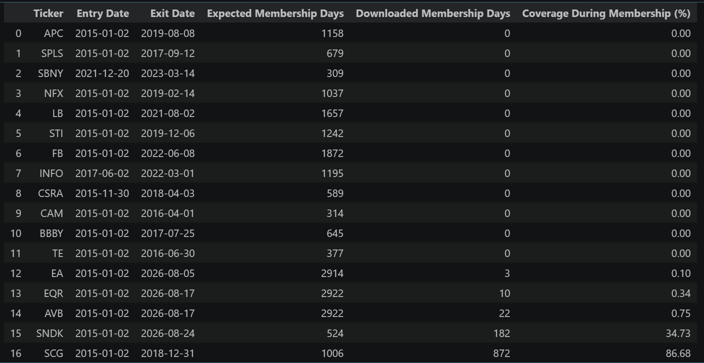
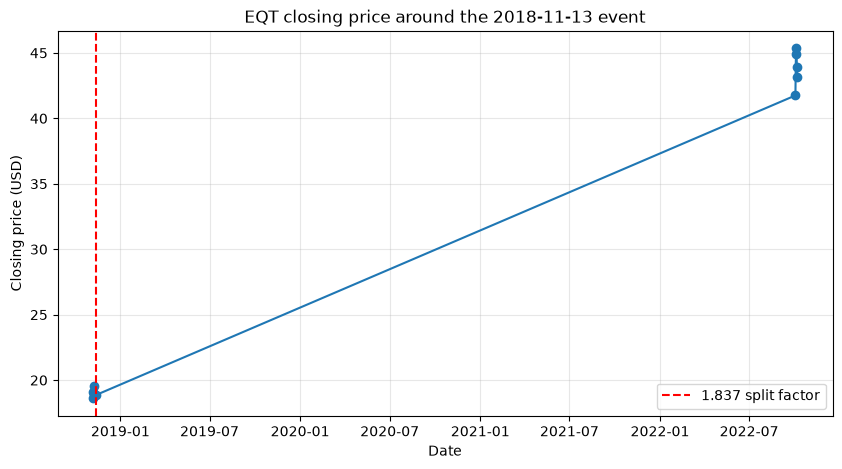
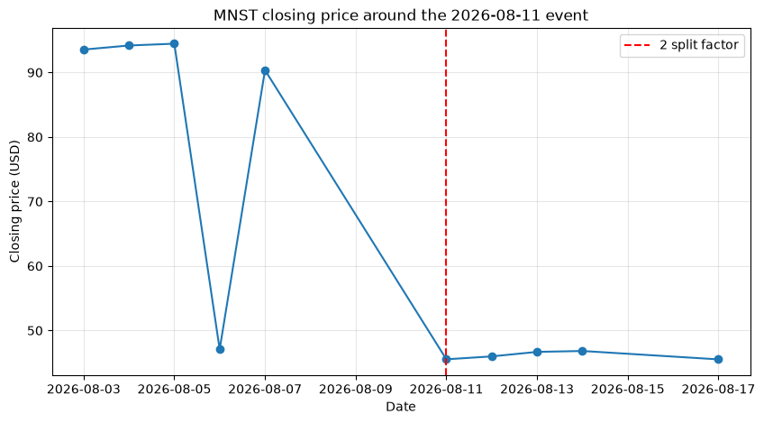
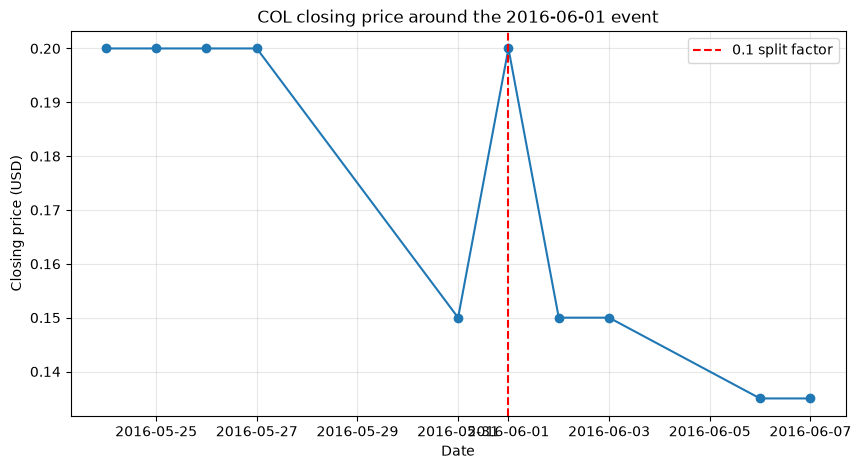
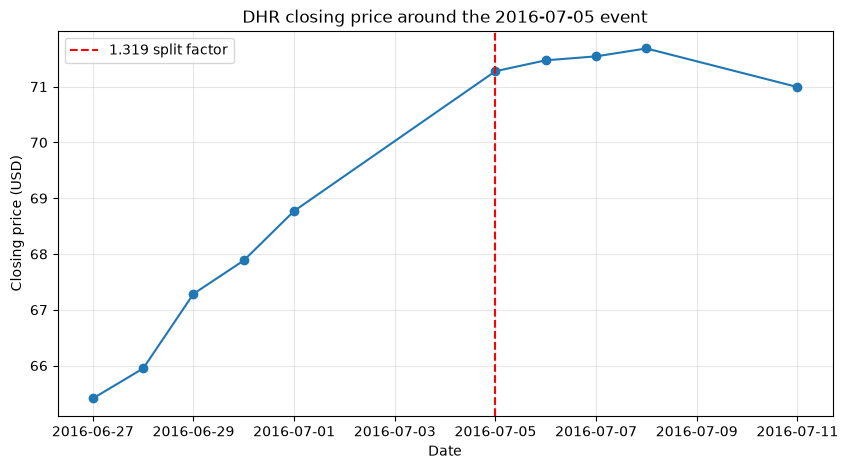
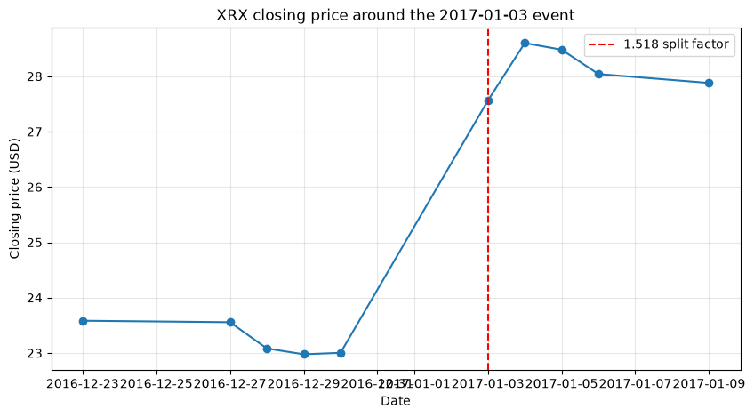
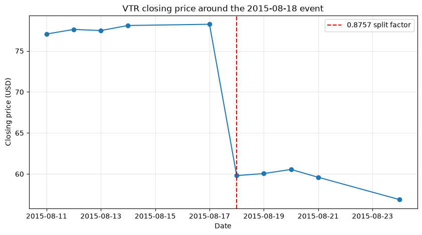

# Pairs Trading Project

This project investigates pairs trading among historical S&P 500 constituents using daily adjusted prices, industry grouping, and rolling cointegration tests. Data preparation and initial strategy experiments are implemented; parameter tuning and final out-of-sample evaluation remain in progress.

**Author:** Jerry Huang
**Project status:** Research in progress 
**Last updated:** 10/1/2026

## Contents

- [Project overview](#project-overview)
- [Repository structure](#repository-structure)
- [Setup and reproduction](#setup-and-reproduction)
- [Data sources and universe](#data-sources-and-universe)
- [Data preparation and quality checks](#data-preparation-and-quality-checks)
- [GICS classification](#gics-classification)
- [Price time-series inspection](#price-time-series-inspection)
- [Research design and pair selection](#research-design-and-pair-selection)
- [Trading strategy and validation](#trading-strategy-and-validation)
- [Final testing](#final-testing)
- [Results and interpretation](#results-and-interpretation)
- [Limitations](#limitations)
- [Lessons and next steps](#lessons-and-next-steps)
- [References and project information](#references-and-project-information)

- [Parameter grid search](#parameter-grid-search)
- [Industry-specific strategy](#industry-specific-strategy)

## Project overview

Pairs trading offers a way to study whether economically related stocks show temporary price divergences that subsequently reverse.

- **Research question:** Can industry-group screening and rolling cointegration tests identify pairs with profitable mean reversion after transaction costs?
- **Hypothesis:** Related companies may share common price drivers, but changes in their businesses or market conditions can break the relationship.
- **Scope:** Historical S&P 500 constituents, daily prices from January 2015 through August 2026, and rolling pair selection with portfolio evaluation.
- **Success criteria:** Evaluate net returns, Sharpe ratio, and maximum drawdown, including sensitivity to trading costs. A final benchmark comparison is still planned.

The workflow downloads price histories, checks membership coverage and stock splits, assigns GICS classifications, screens candidate pairs, and evaluates trading rules in rolling windows before a separate final holdout evaluation.

## Repository structure

```text
pairs_trading_project/
├── README.md
├── environment_ptp.yml
├── notebooks/
│   ├── 01_data_download.ipynb
│   ├── 02_1_stock_coverage.ipynb
│   ├── 02_2_split_analysis.ipynb
│   ├── 02_3_gics_download.ipynb
│   ├── 02_4_stock_time_series.ipynb
│   ├── 03_pair_selection_first_result.ipynb
│   ├── 03_pair_selection_try.ipynb
│   └── 04_backtest.ipynb
├── data/
│   ├── historical/
│   ├── Filter_historical/
│   ├── gics/
│   ├── reports/
│   ├── low_coverage_stocks.csv
│   └── low_coverage_classification.csv
├── outputs/
│   ├── stock_time_series/
│   ├── validation_trial/
│   ├── validation_all_pairs/
│   └── rolling_training/
└── reports/
    ├── coverage_readme.md
    └── split_analysis_readme.md
```

`data/historical` contains downloaded prices; `data/Filter_historical` contains membership-filtered histories. Quality reports and classification source logs record checks and researched additions. `outputs` contains generated artifacts. `validation_trial` and `validation_all_pairs` are earlier experiments; `rolling_training` contains the newer rolling runs and their parameter manifests. Final results are not yet established.

## Setup and reproduction

### Environment

Environment specification: [environment_ptp.yml](environment_ptp.yml).

The supplied Conda export specifies Python 3.14.7 and Linux ARM64 builds, with an absolute environment prefix. On another platform, remove the `prefix` line and adapt platform-specific dependencies. The notebooks also require `pandas_market_calendars`, which is missing from this export. The environment has not been verified on other platforms.

```bash
# Run from the project root; verify this setup on your target platform.
conda env create -f environment_ptp.yml
conda activate venv_ptp
jupyter lab
```

Clone the repository before creating the environment:

```bash
git clone https://github.com/jerryhuang-math/S-P-500-Pairs-Trading-Statistical-Arbitrage-Research.git
cd S-P-500-Pairs-Trading-Statistical-Arbitrage-Research
```

After activating the environment, install the additional calendar dependency with `pip install pandas_market_calendars`. Downloads require network access. Optional alternative-source checks may prompt for credentials; these are not required for the Yahoo Finance download.

### Execution order

Run each implemented notebook from top to bottom in the following order, checking its inputs and outputs before proceeding.

| Step | Notebook | What to document |
| --- | --- | --- |
| 1 | [Data download](notebooks/01_data_download.ipynb) | Dates, network access, download report, valid ticker list |
| 2 | [Coverage analysis](notebooks/02_1_stock_coverage.ipynb) | Membership data, filtering, unresolved files, replacement steps |
| 3 | [Split analysis](notebooks/02_2_split_analysis.ipynb) | Filtered price input, event requests, manual review |
| 4 | [GICS download](notebooks/02_3_gics_download.ipynb) | Mapping inputs and preserved researched classifications |
| 5 | [Price charts](notebooks/02_4_stock_time_series.ipynb) | Chart generation and output location |
| 6 | [Rolling pair selection and training](notebooks/03_pair_selection_try.ipynb) | Candidate generation, validation rules, saved results |
| 7 | [Final backtest](notebooks/04_backtest.ipynb) | Planned: this file is currently empty and cannot yet be executed |

Start notebook kernels in `notebooks/` because several notebooks use relative paths such as `../data`. Review flagged histories and classification sources before strategy evaluation. Reruns can overwrite data, charts, and earlier simulation files; rolling experiments create separate run folders. Runtime and storage requirements have not yet been measured.

## Data sources and universe

The universe includes companies that appeared in historical S&P 500 membership during the study period. Prices are then filtered to membership dates. Historical membership reduces reliance on today’s constituents, but unavailable histories and reused tickers still require review.

| Dataset | Source and version / retrieval date | Purpose | Known gaps |
| --- | --- | --- | --- |
| Historical S&P 500 constituents | [historical_sp500_constituents](https://github.com/chinobing/historical_sp500_constituents); live CSV | Membership dates and ticker universe | Ticker changes and historical company identities need reconciliation |
| Daily stock prices | Yahoo Finance through yfinance; live downloads | Price histories | 121 requested histories unavailable in the saved download report |
| Corporate-action events | Yahoo Finance; live requests | Split checks | Flagged events require interpretation alongside adjusted prices |
| Alternative price histories | Stooq and other recovery attempts in the coverage notebook | Missing or incorrect histories | Recovery remains unfinished |
| Company classifications | [S&P 500 constituent dataset](https://github.com/datasets/s-and-p-500-companies) and researched additions documented in `data/gics/gics2_gics4_sources.csv` | Industry grouping | Static rather than point-in-time |
| GICS hierarchy | March 2023 hierarchy from the GICS mapping linked in the classification notebook | Classification codes | Historical classification changes are not represented |

- **Download interval:** 2015-01-01 to 2026-08-25; the price-download end date is exclusive.
- **Coverage interval:** 2015-01-01 through 2026-08-24, inclusive.
- **Frequency and calendar:** Daily observations; coverage uses the NYSE session calendar. CSV dates are stored as calendar dates.
- **Price field:** Coverage checks use nonmissing `Close`; charts and strategy calculations use `Adj Close` to account for price adjustments.
- **Universe counts:** 737 requested, 616 saved, and 616 mapped to sector and industry group. Eligibility varies by notebook and training window.

### Data schema

| File / dataset | Important columns | Meaning and units |
| --- | --- | --- |
| Individual stock CSV | `Date`, `Open`, `High`, `Low`, `Close`, `Adj Close`, `Volume` | Dates in YYYY-MM-DD format; US stock prices in dollars, adjusted close as supplied by Yahoo, volume in shares |
| Membership data | `date`, `tickers` | Constituent lists by date, used to infer membership periods |
| GICS mapping | `Ticker`, `Company`, sector / industry group / industry / sub-industry codes and names | GICS codes have 2, 4, 6, and 8 digits; researched additions intentionally omit finer classifications |
| Download and quality reports | `original_ticker`, `yahoo_ticker`, `status`, `rows`, `message` in the download report | Download outcome and row count; coverage reports identify insufficient histories |

## Data preparation and quality checks

### Downloads and ticker identity

Source: [01_data_download.ipynb](notebooks/01_data_download.ipynb).

Our scope of analysis is from 2015-01-01 to 2026-08-25 for the S&P 500 companies. We first download all companies' tickers that occured in the S&P 500 during the period from the GitHub repository [historical_sp500_constituents](https://github.com/chinobing/historical_sp500_constituents). This repository contains auto renew the list of S&P 500 historical constituents from 1996/01/02 to present. The source contains membership back to 1996. For downloading, we make one combined list of companies seen during our study period. 

The ticker format of the GitHub repository is slightly different from the one in Yahoo Finance, which is our main source of historical price. So we change the ticker punctuation to Yahoo Finance's format, for example BRK.B becomes BRK-B.

From the GitHub database, we get in total 737 stock tickers during our study period in the S&P 500. We would then download them from Yfinance for the stock price during our study period. Yfinance may return two levels of column namse, we need only the first level: Open, High, Low, Close, Adj Close, Volume. So we process the column name to make it single indexed. We drop duplicates and drop missing close price column. Then we check whether the data is empty. If so, we report "Yahoo returned no price rows" and output the download report in the [download_report](download_report.csv). We try each download twice to avoid internet problems, if the download does not return data in the first time. We save every nonempty price history, even when it is short. 

The exact counts are 737 tickers requested, 616 saved, and 121 unavailable, according to [download_report](data/reports/download_report.csv). Currently, unavailable histories were logged and excluded from the downloaded dataset; recovery from alternative sources remains unfinished. 

# Problem 1: missing 100 download.

Digging deeper into the 121 unavaliable our of 737 ticker symbols (16.4%), we observed that it is mainly due to the following reasons:

1. company renamed/ ticker change (ABC → COR; ANTM → ELV)
The old syhmbol fails, but history may exist under the new symbold. For example, the new price history exist for Cencora and Elevance.
2. Company acquired (ATVI)
Microsoft completed its acquisition in 2023. Historical membership remains valid even though the company no longer trades independently.
3. Failure/ distressed delisting (SIVB, FRC)
These correspond to banks that failed in 2023—particularly important cases to retain in historical research.
4. Unresolved download failure

If the missing 121 memberships' data is not corrected, it introduces the following biases:

- Survivorship and availability bias: the sample favors companies whose histories remain accessible. Using historical constituents helps, but does not eliminate this bias if unavailable companies are then omitted.

- Pairs-trading risk: excluding failures and acquisitions can remove episodes where previously related stocks diverged sharply. That can make relationships appear more stable and risk smaller.

- Distorted pair selection: missing earlier histories can prevent otherwise eligible companies from entering your training sample.

Overall, the dataset is stored at data/historical.

### Membership filtering and coverage

# Problem 2: old ticker problem, 17 coverage still unsolved
I also found a concrete problem in your current files: the raw COR and ELV histories both start in 2015, but their membership-filtered files start only in September 2023 and June
2022, respectively. The filtering matches ticker strings without connecting their earlier identities, ABC and ANTM. Consequently, some historical prices are already downloaded but
  are being discarded during filtering.

Sources: [coverage notebook](notebooks/02_1_stock_coverage.ipynb), [coverage notes](reports/coverage_readme.md).

The next step of data cleaning is check if the dataset is complete. That is whether each stock has enough price data while it was in the S&P 500. We test the completeness of each stock price by first calculating the theoretical coverage. This is calculated by the membership period of the S&P 500. So, if a stock entered S&P 500 at 2021-01-01 and exit at 2022-01-01, this stock theoretically should have 252 close data for 252 trading days. Then, we calculate the actual number of close data in our dataset and compare it with the theoritical number to get the coverage. Stocks with coverage higher than 90% are qualified, while those that are lower would be further investigated.

When we run through our dataset, we found that some stocks have coverage more than 100%. This turns out to be a download problem. In the data/historical database, for each stock than occured in the S&P 500 membership, we download the data according to our study period, instead of this stock's actually period. Thus, the raw file may contain prices from before a stock entred the S&P 500 or after it left. Those extra datas can make actual coverage appear higher than the theoretical coverage. It also might make those low coverage stock's coverage higher such that we cannot spot them using our method. Thus, we need to shorten the data.

To shorten the data, we load the historical S&P 500 membership from the same GitHub repository that we used [historical_sp500_constituents](https://github.com/chinobing/historical_sp500_constituents). This dataset also provide the membership time for each ticker. According to the information in the dataset, we create the membership-period file that each ourput only keeps the dates when its ticker belonged to the S&P 500. The shortened version of the data is then stored in the [Fitler_historical](data/Filter_historical) file. From this point onward, coverage analysisi reads only from [Filter_historical](data/Filter_historical).


We processed the 737 stocks into the shortened version to the Filter_historical. Then, we calculate the coverage. The expected memberhsip days are calculated by combining the information from the membership and the NYSE trading day information. NYSE trading days is imported from pandas_market_calendars package. The actua coverage is calculated by counting on the number of closed price in our dataset. We run through the dataset and get a list of 17 stocks that have stock coverage below 90%.



Diving into those 17 companies, we discovered similar issues when downloading. Every row above is a low-coverage case after membership filtering. These stocks may need a better historical source or manual review before pair selection. The filtered files are also ready for the split-analysis notebook.

`APC` downloaded from Yahoo Finance today is no longer Anadarko Petroleum. Yahoo currently maps `APC` to ARKO Petroleum Corp. a completely different company. ARKO Petroleum only began trading on Nasdaq under `APC` on **February 12, 2026**,

FB becomes META at 2022-06-08. META/historical has the full record of FB+META starting from 2015. So FB can be deleted with META/historical replacing META/Filter_historical.

|  ticker | Historical S&P company     | What's happening now                                                                                                                              | Simple action                   |     |
| ----------- | -------------------------- | ------------------------------------------------------------------------------------------------------------------------------------------------- | ------------------------------- | --- |
| **SPLS**    | Staples                    | `SPLS` has been **reused** by a PIMCO ETF launched in Jan 2026.                                                                                   | Alternate source                |     |
| **SBNY**    | Signature Bank             | Still actually **Signature Bank** on Yahoo, now OTC. Yahoo recognizes the same company.                                                           | Alternate source  |     |
| **NFX**     | Newfield Exploration       | Old ticker disappeared after Encana acquisition; Yahoo still has old articles but no normal active NFX quote.                                     | Alternate source                |     |
| **STI**     | SunTrust Banks             | `STI` now means **Solidion Technology**, an unrelated company.                                                                                    | Alternate source                |     |
| **INFO**    | IHS Markit                 | `INFO` has been **reused**; there is now an ETF using INFO.                                                                                       | Alternate source                |     |
| **CSRA**    | CSRA Inc.                  | Old CSRA disappeared after acquisition; `CSRA` was **reused in Aug 2026** by a Cohen & Steers ETF.                                                | Alternate source                |     |
| **CAM**     | Cameron International      | Old ticker disappeared following the Schlumberger acquisition. Yahoo retains old CAM-related material but not the usable historical quote object. | Alternate source                |     |
| **BBBY**    | Original Bed Bath & Beyond | **Ticker reuse.** The current NYSE `BBBY` is the newer Bed Bath & Beyond/Beyond entity, not the bankrupt historical security in your dataset.     | Alternate source                |     |
| **TE**      | TECO Energy                | `TE` now belongs to **T1 Energy**, formerly FREYR Battery — completely unrelated to TECO.                                                         | Alternate source                |     |
| **EA**      | Electronic Arts            | Same company/ticker. Yahoo clearly still has long historical history ("All" return).                                                              | Alternate source  |     |
| **EQR**     | Equity Residential         | Same company/ticker and Yahoo still carries the security/history.                                                                                 | Alternate source  |     |
| **AVB**     | AvalonBay                  | Same company/ticker and Yahoo still has its long history.                                                                                         | Alternate source  |     |
| **SNDK**    | Old SanDisk                | `SNDK` has been **reused** by the newly independent Sandisk created in 2025. Yahoo describes the current company as incorporated in 2024.         | Alternate source                |     |
| **SCG**     | SCANA                      | Historical US `SCG` disappeared after the Dominion transaction; the old Yahoo identity is no longer normally retrievable by plain `SCG`.          | Alternate source                |     |


# Find an alternative source for those historical ticker companies.

**Coverage rule:** [TODO: Document the current below-90% flag and justify the threshold.]

| Measure | Result |
| --- | --- |
| Tickers examined | [TODO] |
| Tickers below coverage threshold | [TODO: Previous README reports 17; confirm for this run] |
| Histories successfully corrected or replaced | [TODO] |
| Cases unresolved or excluded | [TODO] |

| Ticker / historical company | Problem | Evidence | Action and final status |
| --- | --- | --- | --- |
| [TODO] | [TODO: Ticker reuse, rename, missing prices, etc.] | [TODO] | [TODO] |

[TODO: Explain alternative-source attempts, checks for correct company identity, and any missing-data or exclusion policy. Distinguish proposed corrections from corrections actually applied.]

### Split and corporate-action analysis

Sources: [split notebook](notebooks/02_2_split_analysis.ipynb), [split notes](reports/split_analysis_readme.md).

Then, we need to check for split to see if Yfinance handled it correctly. We want to make sure every split is adjusted smoothly such that there are no artificial price changes. For YFinance website, it is suggested that Close is the closing price after adjustments for splits. Adjusted close is the closing price after adjustments for all applicable splits and dividend distributions. Close and Adjusted close are both downloaded in our dataset. For this project, Adjusted close price are selected as the main price benchmark as it also includes dividend distribution. Therefore, it more accurately reflect the overall gain of our strategy from the historical price. 

In the notebook, our methodology is to check whether Adjusted closing prices remain reasonably smooth around stock split dates. A large jump around the split date may be a pure natural market behavior. Yet it also might indicate the split is not corrected adjusted. So, we will then manually review those abnormal cases afterwards.

The split dates is from Yahoo Finance, through yf.Ticker(ticker).splits. The program read the Adjusted Close price one trading day before the split day and one trading day after the split day from the 'data/Filter_historical' file. The program then compute the price change. We run through every downloaded stocks and every split days. Overall, we checked for 158 split events. 

Our MAX_PRICE_CHANGE is set to be 20%. This threshold is chosen because the smallest common split ratio is 2-for-1, which produces an apparent price change of −50% (or +100% for a reverse split). A 20% threshold sits well below this, providing a safety margin for detection while avoiding false positives from ordinary volatility. Even less common ratios like 5-for-4 (−20%) sit right at the boundary.

In 158 split events the program checked, there are overall 6 events get flagged to review.:

| Ticker | Split Date | Split Factor | Close Before | Close After | Price Change (%) | Smooth |
| :--- | :--- | :--- | :--- | :--- | :--- | :--- |
| EQT | 2018-11-13 | 1.8370 | 17.285431 | 39.374535 | 127.79 | False |
| DHR | 2016-07-05 | 1.3190 | 42.009678 | 67.727325 | 61.22 | False |
| MNST | 2026-08-11 | 2.0000 | 90.360001 | 45.529999 | -49.61 | False |
| XRX | 2017-01-03 | 1.5180 | 12.272588 | 16.891397 | 37.64 | False |
| COL | 2016-06-01 | 0.1000 | 0.150000 | 0.200000 | 33.33 | False |
| VTR | 2015-08-18 | 0.8757 | 48.813263 | 37.305859 | -23.57 | False |

Then, we investigate the six flagged events. There are four kinds of problem here.

The first kind of problem is data-gap artefact. This is the case of EQT, 2018-11-13 (+127.79%). EQT was removed from the S&P 500 effective 2018-11-13 and returned effective 2022-10-03. Local Filter_data file made the two rows adjacent because we only leave the stock price data during its membership of S&P 500. However, the program assumes that the observations immediately before and after a Yahoo `splits` date are consecutive trading days. The assumption does not hold for this case. The compared rows are 2018-11-12 and 2022-10-03, not adjacent trading days. But it was put together in our dataset. And accidentally 2022-10-03 had a split. Thus, this was flagged by the program. This is not an incorrect processing of split. Thus, it does not need further treatment.



The second kind of problem comes from the problem of the Yahoo Finance dataset. This the case for MNST 2026-08-11 (-49.61%). A genuine 2-for-1 split occurred, but the local Yahoo history mixes adjusted and unadjusted pre-split days. The local Yahoo file is inconsistent around it: August 5 is $94.46 (unadjusted), August 6 is $47.08 (adjusted), August 7 reverts to $90.36 (unadjusted), and August 11 is $45.53 (adjusted); August 10 is missing altogether. An independent history reports split-adjusted closes of $47.23, $47.08, $45.18, $45.72, and $45.53 for August 5, 6, 7, 10, and 11 respectively. This requires another independent source then Yahoo Finance to get alternative data.



The third kind of problem is the historical ticker problem. This is the case for COL, 2016-06-01 (+33.33%). The intended S&P 500 constituent was Rockwell Collins (NYSE: COL). The file is penny-stock data associated with a Canadian `COL` security 1-for-10 consolidation, not Rockwell Collins. The 10-1 consolidation is the inverse of Yahoo's displayed 0.1 factor. this file should be rejected and, if Rockwell Collins is required, replaced using an identifier-aware historical source. 



# where to find alternative sources

The fourth kind of problem is the special corporate action. This is the case for DHR, 2016-07-05 (+61.22%), XRX, 2017-01-03 (+37.64%), and VTR, 2015-08-18 (-23.57%). This comes from the incomplete assumption that every event returned as a split is an ordinary share split. For DHR, Danaher spun off Fortive; Yahoo's `Adj Close` adjustment changes discontinuously. For XRX, Xerox distributed Conduent; Yahoo labels/adjusts the spin-off like a split. Xerox completed the Conduent separation at year-end 2016. Holders received one CNDT share for every five XRX shares, and the two companies traded separately from 2017-01-03. For VTR, Ventas distributed Care Capital Properties and began trading ex-distribution. It was a real ex-distribution price change, while Yahoo's VTR-only adjusted series does not neutralize the value transferred to CCP. A proper return calculation must include the distributed CCP shares (or use a verified total-return series).







# How to treat with these stock. 

[TODO: Explain why a flagged jump is a review signal rather than proof of bad prices. State whether any files were changed and where changes are recorded.]

## GICS classification

Sources: [GICS notebook](notebooks/02_3_gics_download.ipynb), [dataset notes](data/gics/README.md).

We download the Global Industry Classification Standard (GICS) data for each stock in our database to better pair stocks up during the pairs selection. The GICS structure consists of 11 sectors, 25 industry groups, 74 industries and 163 sub-industries. GICS has four levels: a 2-digit sector, 4-digit industry group, 6-digit industry, and 8-digit sub-industry.

In the pairs selection step, we would use industry groups as a first selection mechanism to screen pairs. Then, we would implement correlation testing and cointergration testing among pairs within the same industry group. Since for two stocks in the same industry, they typically share common fundamental drivers — consumer demand, input costs, regulation, and market sentiment — so their prices tend to be more probably cointegrated. Industry group starts as a good sample space for selecting pairs because they are not too big or to specific. Searching pairs from a too broad sample space take much more computation, as the time complexity is O(n^2). Moreover, it might just take two companies that have statistically conintergrated prices only by pure chance with little economic reasons. That's why we restrict our sample space to industry based level.

Here is a quick estimation. There are in total 616 comapnies in our universe. On average, there are 24.64 (616/25) companies in each industry group, which are about 300 pairs per industry group. This is computationally possible. But if we specify more on 74 industries, there are on average 8.32 companies per each industry. And we may lose potential tradable pairs there. Thus, industry groups are a more appropriate scope for the first screening of pairs selection.

This notebook downloads GICS classifications for the stock universe and saves them separately in `data/gics`.

The public constituent source contains current S&P 500 ticker-to-sub-industry assignments. Each companies's sub industry tag is downloaded through the [Github dataset](https://github.com/datasets/s-and-p-500-companies).Then, for each sub industry ticker, we map it into the GICS code through the following GICS mapping dataset. The GICS mapping for each sub industry is downloaded through the [Github dataset](https://gist.github.com/uknj/c9bcf66ab379a35fcc8758f9a6c86cebFormer).

The problem is that the current open-source GitHub database only contains the current S&P 500 companies' current sub industry information. It doea not contain information for historical comapnies or informations about sub industry changes. A company’s GICS classification can change when its business changes, after a merger or spin-off, or when the GICS system itself is revised. The free source used here provides the current classification, not the classification that was known on each historical date.

Here is another reason why we choose industry groups as the first screening method. The more specified industries or sub industries information can possibly change throughout the development of the company. However, most companies on S&P 500, which are large and mature, do not change from a industry group to another. The change is too radical for a S&P 500 listed company. In fact, there are little major industry group change voluntarily taken by an S&P 500 listed company. The only change of a few companies are due to 

| Year     | Change                                                                                                                                                                                                                                                                                                                                                                                        | Impact on Industry Group                                                                                                                                         |
| -------- | --------------------------------------------------------------------------------------------------------------------------------------------------------------------------------------------------------------------------------------------------------------------------------------------------------------------------------------------------------------------------------------------- | ---------------------------------------------------------------------------------------------------------------------------------------------------------------- |
| **2016** | Real Estate elevated from an [Industry Group (4040) within Financials to its own Sector (60)](https://www.spglobal.com/spdji/en/documents/additional-material/spdji-the-new-gics-real-estate-sector-and-sp-us-benchmarks.pdf#1#1)[](https://press.spglobal.com/2016-03-08-S-P-Dow-Jones-Indices-And-MSCI-Revisions-To-The-Global-Industry-Classification-Standard-GICS-Structure?asPDF=1#1#1) | The **Real Estate Industry Group (4040)** was discontinued. A new **Real Estate Industry Group (6010)** was created under the new Sector.                        |
| **2018** | Telecommunication Services renamed/broadened to Communication Services[](https://www.spglobal.com/spdji/en/documents/clientservices/gics_press_release-20180111.pdf#1#1)[](https://www.nasdaq.com/articles/big-tech-sector-shake-put-these-stocks-and-etfs-focus-2018-09-24#1)                                                                                                                | The **Media Industry Group** was **removed** from Consumer Discretionary and **added** to the new Communication Services Sector (renamed Media & Entertainment). |

# How to solve this issue

If the classification method for the first screen of the companies are changing historically and we use the currently information to approximate the historical information, this invites look-ahead biases: a backtest may group two stocks together using information that was assigned only later.

For now, since we checked that the industry group classification is stable. This project makes the simplifying assumption that each company’s current GICS industry group also applies to its past observations. This keeps the workflow straightforward. Moreover, as the industry group is only our first screening method, results that depend on industry matching is only treated as preliminary.

A future version should use point-in-time GICS history. That dataset would contain a ticker or permanent company identifier, an effective start date, an effective end date, and the GICS code for each period. The backtest could then select the classification that was valid on each date. Sources such as WRDS/Compustat HGIC or FactSet can provide this history, but they require licensed access.

We saved the avaliable companies' GICS code in [ticker_gics file](data/gics/ticker_gics.csv).

Yet there is another problem: the GitHub data source only contains the current 503 companies' information. Our study universe contains every company occured in S&P 500 during our study time. Thus, there are 113 undocumented data and unmatched tickers. To solve it, it is sufficient to manually search for each company one by one and get the industry group information online. This is because the industry group information is open for public traded companies, especially the more prominent ones on S&P 500. The only problem is there is not a organized dataset. Manually serarch for 113 companies would take up many time. So we try to do it with AI Agent to help us search.

AI Agent searched through and output the unmatched 113 companies' industry group information in the [ticker_gics file](data/gics/ticker_gics.csv). This turns out to be highly efficient and accurate. The information source of each companies' information is listed in [gics2_gics4_sources.csv](data/gics/gics2_gics4_sources.csv). Every 113 companies are successfully found by the AI Agent. We manually checked for some companies choosing randomly from each indsutry group, and no mistakes are found. This demonstrates a very efficient way to use AI to gather and organize information quickly.

Now, all GICS_4 codes are downloaded for 616 stocks in our database. 


## Price time-series inspection

Source: [price-chart notebook](notebooks/02_4_stock_time_series.ipynb).

[TODO: Explain the reusable plot function, adjusted-price series, and per-stock charts saved to `outputs/stock_time_series`.]

[TODO: Insert representative figures using relative paths and captions. Explain what each figure reveals about gaps, discontinuities, or price behavior.]

## Research design and pair selection

Source: [03_pair_selection.ipynb](notebooks/03_pair_selection.ipynb).

Overall, rolling window training and backtesting is used instead of static training/ validating/ testing split. This is becuase the cointergration relationship of the two stocks mostly would not continue for a long time. Therefore, the dataset is split into two parts. The first part is for training and adjusting the strategy. The second part is for validation, using the last three years of the data. In this notebook, the validation set is not used. The rolling window has a training time span of 12 month and a trading time of 2 month. For each rolling window, we use the same methodology to select the pairs and determine the trading strategy. We run through the correlation between every two stocks in a given industry group (4 code GICS). We select the stock pairs that have log Adjusted Close correlation greater than 0.8 to proceed to the cointergration test. Then, Engle-Granger test is implemented. The Engle-Granger test first determine the linear regression coefficient of the spread. Then, it applys the Augmented Dickey-Fuller (ADF) to determine the stationarity of the spread. The significant level is set to be 5%. We use Engle-Granger-specific critical value. Since the regression A on B vs B on A is different, we test both directions. Using this procedjure, we selected pairs and the hedge ratio. We then trade these pairs according to their hedge ratio on the next 2 month. In the two-month trading period, the hedge ratio, mean, and standard deviation is frozen. 

The entry point, exit point, stop loss point are initially set as 1.5 s.d., 0.5 s.d, and 3 s.d. For pairs reaching stop-loss, they will be blacklisted  for the rest of the trading window. For multiple pairs, the capital allocation method is equal-weight, independent positions. The transaction cost sets to 10 bps per leg.

After we walk through every rolling window, we chain the 2-month returns into one continuous equity curve. We compute a set of parameters on the full curve determining the performance of this strategy.

### Chronological split

The entire dataset is split into two parts — training set and validation set. This notebook develops the strategy only inside the training set. The final three calendar years are an untouched validation set for future out-of-sample validation.

| Period | Current design | Purpose |
| --- | --- | --- |
| Training | 2015.1.1 –2023.1.1 | 12-month rolling window for pair screening, spread estimation, strategy evaluation and parameter decisions|
| Validation | 2023.1.1 – 2026 | Planned final evaluation of frozen decisions |

The 2023–2026 period is a final evaluation period. Any parameter tuning is done via cross-validation on the 2015–2023 data. The 2023–2026 split is touched exactly once at the very end of the analysis.

A single, large holdout is less susceptible to the "lucky split" problem where a model looks good just because the test period happened to be easy. 

The 3 year split is appropriate as it account for about 25% of the entire dataset. The 3-year length guarantee that it is long enough to include different market regime. The final test on our model would be more robust. Yet the training set is also long enough to have enough rolling window to test the strategy on roughly 40 windows.

## Rolling window

We choose the rolling window backtesting instead of a traditingal train-validation-test split. A traditional backtest might pre-determine the trading pairs in the first train set. Then, it uses the second validation split for parameter tuning. In a rolling window backtesting in our training set, for each rolling window, there are a 12-Month Formation Period and 2-Month Trading Window. In the formation period, we would determine the trading pair, the hedge ration, the spread's mean and standard deviation, and then use these information to trade in the next 2-Month Trading Window. The rolling window proceed 2-month per step. Thus, the first rolling window in the training set is 2015-1 to 2015-12 as the formation Period and 2016-1 to 2016-2 as the Trading Window. The next rolling window would move forward two month. The formation period starts from 2015-3 to 2016-2. The trading window is 2016 March and April.

This rolling window strategy resembles the real trading method better. The stationarity of two stocks are not permanent. They occurs during a window. A 12-month formation period is long enough to capture the stationarity before it disappear. A well-designed walk-forward evaluation can maintain strong generalization across different market periods. The 12-month formation period is specifically chosen initially as it is the industry standard. The Gatev et al. (2006) methodology, which is the foundational work in pairs trading, uses a 12-month formation period followed by a 6-month trading period. Many subsequent studies, including Caldeira and Moura (2013), follow this convention or use variations of it.

As for the trading window, Shorter trading periods reduce the risk of outdated information. Increasing this period is not advantageous, as the longer the period, the greater the chance of forming pairs based on outdated information. A 2-month trading window is conservative in this regard—it ensures we are not trading on stale cointegration relationships. It also ensure a decent amount of trading time. So a winning yet unfinished trade would not be cut due to the trading window switch.

The rolling window is set to step 2 month at a time because it perfectly covers the trading period. Using a 2-month step with a 2-month trading window eliminates the statistical issue of overlapping data. It also covers all avaliable data to trade. If the 2-month step get shortened, two adjacent trading window would overlap. Overlapping portfolios create complexity when we are evaluating the overall performance of the strategy. It is more complex to chain the return of each rolling window together, since each month is traded twice. By moving forward 2 month at a time, we ensure that each calendar month belongs to exactly one trading decision.

In each rolling window, trading pairs are reselect independently. The exact procedure is discussed in the following section. 

### Candidate generation

First, group stocks by the existing four-digit Industry Group Code. As discussed in the GICS download section, this is for less computing and more efficient screening. It also helps screening out unrelated pairs with little economic reasons underlying but pure through randomness.

Then, calculate daily adjusted-close log returns. Here, we are using the log returns of two stocks to calculate Pearson correlation. The Pearson Correlation acts as the second screening before the last Engle-Granger test. 

We use Pearson correlation as the second screening as 

## continue here
      - Retain correlations strictly greater than 0.8.
      - Use training-window eligibility only. My proposed default is complete, positive prices throughout that 12-month window, with no filling of missing prices.
      - Calculate returns before matching observations, so missing dates cannot silently turn daily returns into multi-day returns.

  
[TODO: Describe same-sub-industry grouping, shared dates, missing values, and Pearson correlation of adjusted price levels. The current threshold is strictly greater than 0.8; the initial screen permits as few as two shared observations. Explain the implications and any later history requirements.]

### Spread estimation and stationarity screening

[TODO: Explain the fitted model, ticker ordering, intercept, hedge ratio, and economic interpretation.]

```text
log(P_A,t) = alpha + beta × log(P_B,t) + spread_t
```

[TODO: Document training-only OLS fitting, positive-price requirements, and excluded observations. Describe ADF with a constant, AIC lag selection, and the current p-value threshold below 0.01.]

**Statistical interpretation:** The current procedure uses ordinary ADF p-values on fitted residuals. They are not calibrated Engle–Granger cointegration p-values and are not adjusted for multiple pair tests. Explain how this limits your conclusions.

| Selection stage | Count retained | Exclusion rule / notes |
| --- | --- | --- |
| Stocks with usable training prices | [TODO] | [TODO] |
| Stocks with required classification | [TODO] | [TODO] |
| Within-sub-industry pairs | [TODO] | [TODO] |
| Correlation-screened pairs | [TODO] | [TODO] |
| Pairs with valid spread/ADF results | [TODO] | [TODO] |
| Selected validation candidates | [TODO: Notebook prose currently describes 66] | [TODO] |

## Trading strategy and validation

### Signal and execution rules

[TODO: Define the spread z-score and identify the training estimates used to standardize it. Explain long and short spread positions in terms of both legs.]

| Parameter / behavior | Current validation implementation | Rationale / final setting |
| --- | --- | --- |
| Estimation | Training alpha, beta, spread mean and sample standard deviation stay fixed | [TODO] |
| Long entry | `-3 < z <= -1.5` | [TODO] |
| Short entry | `1.5 <= z < 3` | [TODO] |
| Normal exit | Return inside 0.5 standard deviations, including crossing the mean | [TODO] |
| Stop | Adverse move beyond 3 standard deviations | [TODO] |
| Execution | Close signal executes at next trading day's close | [TODO] |
| Starting capital | $100,000 independently per pair | [TODO] |
| Entry exposure | 100% gross after entry costs | [TODO] |
| Leg weights | `direction × [1, -beta] / (1 + abs(beta))` | [TODO] |
| Position holding | Fixed adjusted-price units until exit; no daily rebalancing | [TODO] |
| Costs | Default 10 bps of traded value on both legs at entry and exit | [TODO] |
| End of period | Liquidate remaining positions at final validation close | [TODO] |

[TODO: Explain re-entry, missing-price checks, and next-close execution consequences. Document omitted borrow fees, financing, and cash interest, and the use of adjusted prices as a total-return proxy.]

## Parameter grid search

Planned: compare a small grid of formation lengths, trading windows, correlation thresholds, and entry/exit/stop levels using rolling evaluation within the training data. Record each configuration and compare net returns, Sharpe ratio, drawdown, and trade counts. Freeze the selected settings before evaluating the final holdout.

## Industry-specific strategy

Planned: compare pairs-trading performance across GICS industry groups to examine where mean reversion is most consistent. Test any industry-specific settings within the training data, then compare them with the shared baseline on the final holdout.

### Evaluation and saved artifacts

[TODO: Describe evaluating each pair independently. Explain that this does not establish the performance of a portfolio holding all pairs together.]

Current validation outputs are saved under `outputs/validation_all_pairs`: `summary.csv`, per-pair daily histories, and per-pair trade logs.

[TODO: Define net/gross returns, annualization, volatility, Sharpe assumptions, maximum drawdown, trade counts, win rate, and turnover. State units and sign conventions.]

### Experiment history

| Experiment / date | Hypothesis or change | Parameters | Validation result | Decision |
| --- | --- | --- | --- | --- |
| [TODO] | [TODO] | [TODO] | [TODO] | [TODO] |

[TODO: Describe parameter selection and any repeated use of validation data. Record unsuccessful experiments as well as successful ones.]

## Final testing

**Current workspace status:** `notebooks/04_backtest.ipynb` is empty. Complete this section when the test workflow exists.

[TODO: State the final frozen strategy, exact test period, selected pairs, capital allocation, costs, and benchmark. Explain how you prevent test data from affecting selection or tuning.]

[TODO: If combining pairs, document shared stock exposure, simultaneous positions, portfolio weights, capital constraints, and portfolio return accounting.]

[TODO: Link the completed notebook and final output artifacts, and report differences between validation and test performance.]

## Results and interpretation

[TODO: Lead with your main finding, supported by a specific output. Separate data-quality findings, pair-selection findings, validation performance, and final test performance.]

| Metric | Validation | Final test | Benchmark |
| --- | --- | --- | --- |
| Evaluation dates | [TODO] | [TODO / not run] | [TODO] |
| Net cumulative return | [TODO] | [TODO] | [TODO] |
| Annualized return | [TODO] | [TODO] | [TODO] |
| Annualized volatility | [TODO] | [TODO] | [TODO] |
| Sharpe ratio | [TODO] | [TODO] | [TODO] |
| Maximum drawdown | [TODO] | [TODO] | [TODO] |
| Completed trades | [TODO] | [TODO] | [TODO / N/A] |
| Win rate | [TODO] | [TODO] | [TODO / N/A] |
| Turnover and total costs | [TODO] | [TODO] | [TODO / N/A] |

[TODO: Label whether these figures describe an individual pair, a distribution across pairs, or an implemented portfolio. Do not present summed independent-pair results as portfolio performance.]

[TODO: Add relevant figures: selection funnel, spread/z-score example, equity curve, drawdown, and performance across pairs. Give each a date range, units, and caption.]

[TODO: Discuss whether the evidence supports your hypothesis, where performance is concentrated, sensitivity to costs/parameters, and failed or unstable pairs. Link every reported result to a saved artifact or notebook output.]

## Limitations

[TODO: Explain the limitations that actually apply and their likely effect on interpretation.]

- **Historical data:** [TODO: Missing/delisted companies, ticker reuse, unresolved prices, and sample exclusions.]
- **Membership and gaps:** [TODO: Disjoint membership intervals and the treatment of nonconsecutive dates.]
- **Classification:** [TODO: Static GICS, missing sub-industry codes, and selection coverage.]
- **Statistics:** [TODO: Price-level correlation, short overlap, residual ADF calibration, multiple testing, and relationship instability.]
- **Research process:** [TODO: Validation reuse, parameter search, and potential data leakage.]
- **Execution:** [TODO: Next-close assumptions, short availability, costs, and adjusted-price accounting.]
- **Portfolio scope:** [TODO: Independent simulations versus combined capital and overlapping exposures.]
- **Reproducibility:** [TODO: Revised online data, manual interventions, and environment portability.]

## Lessons and next steps

[TODO: Explain what you learned, which decisions changed during the project, and what you would do differently.]

| Priority | Remaining work | Why it matters | Completion criterion |
| --- | --- | --- | --- |
| [TODO] | [TODO: Resolve remaining historical data issues] | [TODO] | [TODO] |
| [TODO] | [TODO: Improve classification history or document approximation] | [TODO] | [TODO] |
| [TODO] | [TODO: Freeze strategy and implement final testing] | [TODO] | [TODO] |
| [TODO] | [TODO: Add relevant robustness or portfolio analysis] | [TODO] | [TODO] |

## References and project information

### References

[TODO: Cite datasets, papers, methodology references, and software documentation actually used. Include dataset versions, retrieval dates, and links supporting manual corrections.]

| Reference | Used for | Version / date / link |
| --- | --- | --- |
| [TODO] | [TODO] | [TODO] |

### Related project notes

- [Coverage analysis notes](reports/coverage_readme.md)
- [Split analysis notes](reports/split_analysis_readme.md)
- [GICS dataset and enrichment notes](data/gics/README.md)

### Authorship, acknowledgments, and license

[TODO: State your contributions and acknowledge any collaborators, tools, or external work as appropriate.]

[TODO: Specify the code license if you choose one, and separately explain data availability and redistribution conditions. Add contact or contribution instructions if you want them.]